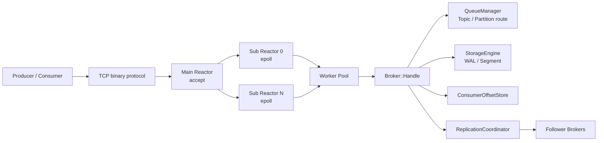
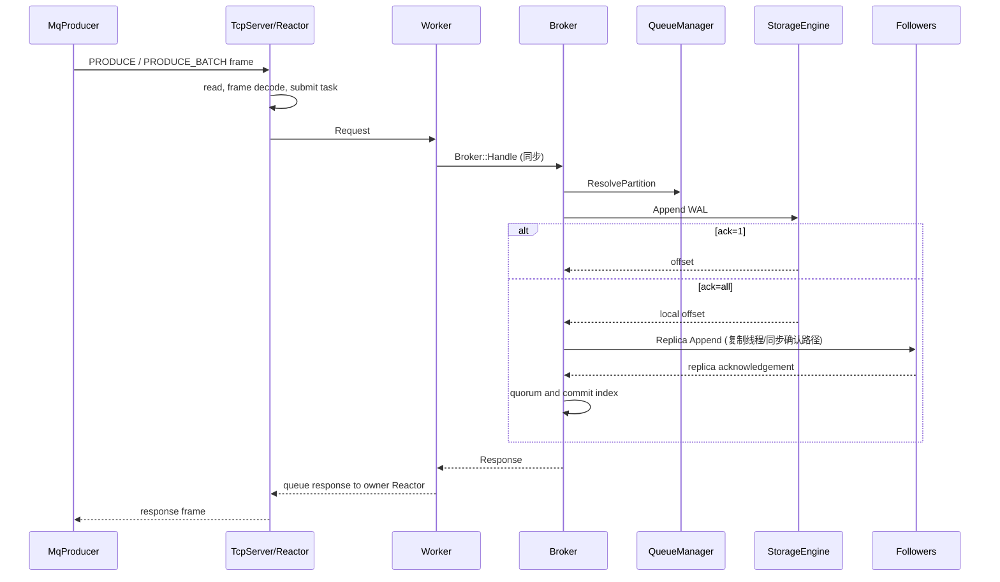
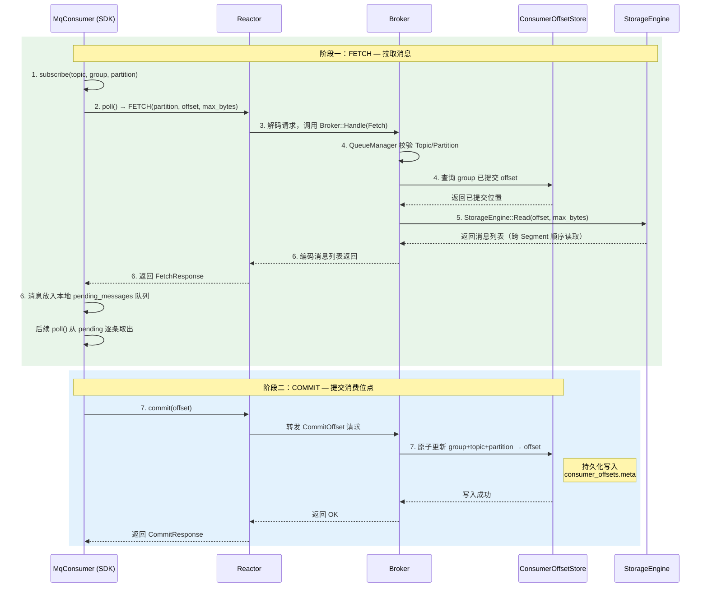
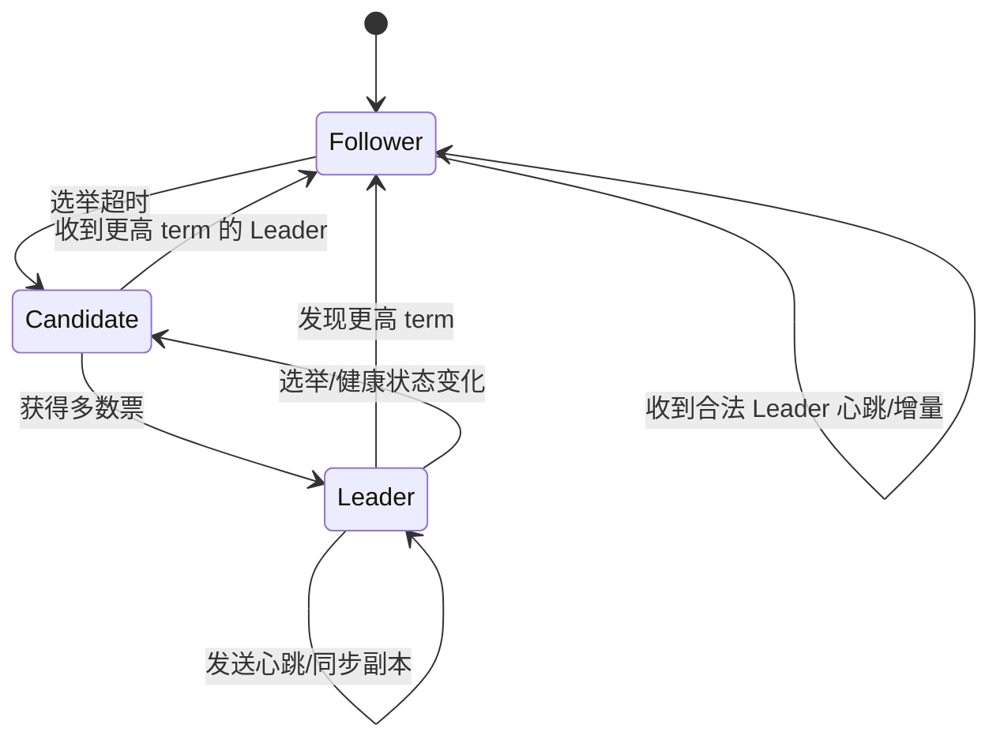
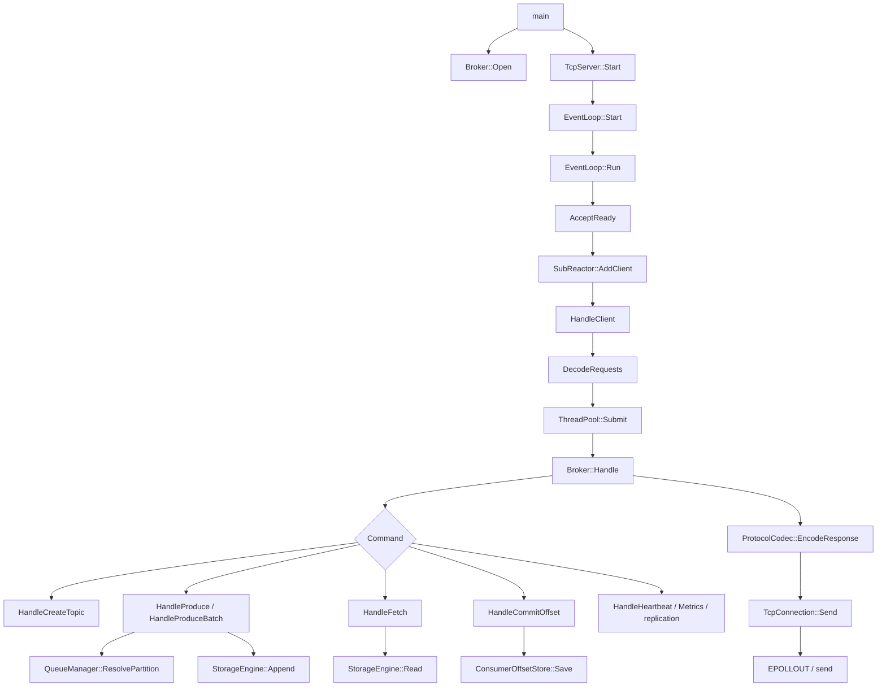

# mq-project 消息队列项目技术分析报告

## 文档信息

| 项目 | 内容 |
|---|---|
| 项目名称 | `mq-project` |
| 项目语言 | C++17 |
| 代码仓库 | [https://github.com/BluesABC/mq-project](https://github.com/BluesABC/mq-project) |
| 核心定位 | 采用分区日志模型、Reactor 网络模型和 WAL 持久化的轻量级高性能消息队列 |
| 主要平台 | Linux 优先；Windows 提供 `select` 兼容实现 |
| 主要依赖 | C++ 标准库、系统 Socket/线程能力；TLS 可选依赖 OpenSSL |

本文基于当前仓库代码、`PRD.md`、`docs/architecture.md`、`docs/design-details.md`、`docs/api-spec.md` 和 `docs/deployment.md` 编写。文中“当前实现”以代码行为为准，“规划/专项”会单独标注。

## 1. 项目概述

### 1.1 设计目标

项目目标是在较少第三方依赖的前提下，提供一条完整的消息链路：Topic 管理、分区生产、批量生产、Consumer Group 消费、offset 提交、WAL 持久化、消息恢复、复制、指标和基础安全控制。

PRD 设定的主要目标是：

- 单 Broker 在批量场景达到 10 万 TPS 级生产和消费能力；
- 通过 WAL、CRC、fsync 和恢复扫描保证消息落盘可恢复；
- 通过 Topic/Partition/Offset 模型支持顺序追加和并行消费；
- 通过主从复制、心跳、任期、投票和 quorum ack 提供高可用基础；
- 通过 TLS、Token、ACL、限流和配额提供基础生产保护。

### 1.2 与同类产品的差异

| 对比维度 | `mq-project` | Kafka | RocketMQ | NATS/JetStream | RabbitMQ |
|---|---|---|---|---|---|
| 核心模型 | Topic + Partition + Offset | Topic + Partition + Offset | Topic + Queue + ConsumeQueue | Stream + Subject | Exchange + Queue |
| 存储方式 | 自研 WAL Segment 和稀疏索引 | 分区日志和索引 | CommitLog + ConsumeQueue | Stream 持久化 | 队列消息存储 |
| 网络实现 | 自研 C++ Reactor | Java 网络线程模型 | Java/Netty | Go 网络模型 | Erlang/BEAM |
| 高可用 | TCP 复制、心跳、quorum ack | 副本同步和控制器选主 | 主从复制和 NameServer 等组件 | 集群复制和 Raft 组件 | 镜像队列/Quorum Queue |
| 生态成熟度 | 学习、研究和定制化基础 | 成熟的日志流平台 | 成熟的业务消息平台 | 轻量云原生消息系统 | 复杂路由和任务队列 |
| 主要优势 | 依赖少、实现可控、便于研究内部机制 | 生态、规模和工具最完整 | 事务/顺序/延迟消息能力丰富 | 简洁、低延迟、运维轻 | 路由能力和协议生态丰富 |

本项目最接近 Kafka 的分区日志思想，但不是 Kafka 协议兼容实现，也没有 Kafka 的成熟控制器、事务、Schema、Connect、跨地域复制和生态工具。与 RocketMQ 相比，本项目更强调底层网络、WAL 和并发模型的自研；与 RabbitMQ/NATS 相比，本项目更偏向可回溯的追加日志，而不是复杂路由或极简发布订阅。

### 1.3 整体架构风格

项目是**中心化 Broker、存储与计算同进程、分区日志型**架构：客户端通过 TCP 访问 Broker，Broker 同时负责协议接入、路由、业务处理和本地 WAL；Follower 通过 Broker 间 TCP 连接同步数据。

它不是存算分离架构，也不是嵌入式库。单节点可以独立运行；配置多个副本节点后形成主从部署。网络层和业务层通过请求/响应对象隔离，存储层通过 `StorageEngine` 作为唯一持久化入口。

## 2. 核心概念与术语

| 概念 | 一句话定义 | 类比 |
|---|---|---|
| Broker | 接收请求、执行业务路由并管理存储与副本的服务节点 | 仓库的总调度中心 |
| Topic | 消息的逻辑分类名称 | 一本按主题分类的账簿 |
| Partition | Topic 下独立追加、独立 offset 的数据分片 | 账簿中的一册分册 |
| Message | 由 key、value、时间戳和 offset 组成的消息记录 | 账簿中的一条记录 |
| Offset | 同一分区内单调递增的消息位置 | 记录的流水号 |
| Producer | 向 Broker 发送消息的客户端 | 发货方 |
| Consumer | 从 Broker 拉取消息的客户端 | 取货方 |
| Consumer Group | 共享消费进度、协同消费 Topic 的消费者集合 | 一个共同处理订单的班组 |
| Commit Offset | Consumer Group 对已处理位置的持久化提交 | 班组在清单上签字到某一行 |
| WAL | 先将变更追加到日志，再向调用方确认的持久化机制 | 先记入不可擦除流水账，再更新正式台账 |
| Segment | WAL 被切分后的固定大小日志文件 | 流水账按册分卷 |
| Sparse Index | 每 N 条消息记录一次 offset 到文件位置的索引 | 每隔若干页设置一个目录书签 |
| fsync | 请求操作系统把文件内容刷入稳定存储 | 要求仓库把账本真正锁入保险柜 |
| Ack | Producer 等待 Broker 返回成功的确认级别 | 发货方要求的签收等级 |
| Leader | 当前负责接受写入和协调复制的节点 | 主仓库 |
| Follower | 从 Leader 拉取并追加副本日志的节点 | 备用仓库 |
| Quorum | 集群中足以形成多数派的节点数量 | 超过半数成员共同签字 |
| Term | 选举或领导关系的逻辑任期编号 | 第几届负责人 |
| Reactor | 监听 IO 事件并将连接操作串行化到固定线程的事件循环 | 每个窗口固定由一个调度员处理 |

## 3. 工作流程

### 3.1 消息生产流程

1. `MqProducer` 组装 Topic、partition、key、value、request id 和 ack flags。
2. SDK 通过 TCP 建立或复用连接；请求使用大端序的 length-prefixed 二进制帧。
3. Main Reactor 接收新连接，Linux 下按 Round-Robin 将连接投递到 Sub Reactor；同一连接固定属于一个 Reactor。
4. Sub Reactor 在非阻塞 socket 上读取数据，处理半包/粘包并解码完整请求。
5. 完整请求投递到 Worker Pool，Worker 同步调用 `Broker::Handle`。
6. Broker 检查协议版本、flags、客户端 Token、ACL、Leader 角色、生产限流和 Topic 字节配额。
7. `QueueManager::ResolvePartition` 校验 Topic/Partition；自动分区时用 key 的稳定哈希选择分区。
8. `StorageEngine::Append` 生成分区内 offset，构造 CRC + 长度 + 消息体记录，追加到当前 WAL Segment；超过段大小时创建下一个编号的 `.log` 和 `.index` 文件。
9. 按 ack 策略返回：`ack=0` 不等待响应，`ack=1` 等本地写入成功，`ack=all` 还等待配置副本达到 quorum 并推进 commit index。
10. Worker 编码响应并通过所属 Sub Reactor 的写任务回投，最终由 `EPOLLOUT` 发回客户端。

幂等生产在请求带 `PRODUCER_METADATA` 时使用 `(topic, producer_id, sequence)` 作为近期缓存键。重试使用相同 sequence 时直接返回第一次结果，避免重复追加；缓存当前为进程内、带过期时间的滑动式缓存，不是跨重启持久化幂等日志。

### 3.2 消息消费流程

1. `MqConsumer::subscribe` 保存 Topic、Group 和分区信息。
2. `poll(timeout_ms)` 发起 `FETCH` 请求，携带 partition、起始 offset、最大返回字节数；带 group 时 Broker 可将已提交 offset 作为读取下界。
3. Reactor 解码请求，Worker 调用 `Broker::Handle` 的 Fetch 分支。
4. Broker 通过 `QueueManager` 校验 Topic/Partition，并从 `ConsumerOffsetStore` 查找 Group 的已提交位置。
5. `StorageEngine::Read` 按 offset 读取消息；当前实现遍历已恢复的 Segment 内存索引，逻辑上支持跨段顺序读取并受 `max_bytes` 限制。
6. Broker 编码消息列表返回；SDK 将一次 Fetch 返回的多条消息放入本地 pending 队列，后续 `poll` 逐条取出。
7. Consumer 处理消息后调用 `commit(offset)`，Broker 原子更新 `group + topic + partition -> offset` 并写入 `consumer_offsets.meta`。

### 3.3 高可用流程

当前高可用实现包括 `ReplicationClient`、`ReplicationCoordinator`、Leader/Follower 角色、周期性增量拉取、复制心跳、任期字段、投票接口、日志连续性检查和 quorum ack。

正常复制过程如下：

1. Follower 的复制循环按 Topic/Partition 读取本地复制 offset。
2. Follower 通过 `REPLICA_FETCH` 向 Leader 拉取增量消息。
3. Leader 返回消息；Follower 只接受与本地 `next_offset` 连续的数据，然后通过 `AppendReplica` 写入本地 WAL。
4. Follower 通过复制心跳上报 replicated offset。
5. Leader 收集副本进度。`ack=all` 只有本地写入加足够副本确认后才推进分区 commit index。
6. Follower 长时间收不到 Leader 时进入候选状态，增加 term 并发起 `REPLICA_VOTE`；投票请求携带候选者日志位置和日志任期。
7. 新 Leader 对外接受写入，旧 Leader 如果发现更高任期或不再满足多数派，应停止提供可靠写入。

需要准确区分实现状态：仓库已经有任期、投票、commit index 和网络分区写入保护的代码路径，但项目文档仍明确说明它不是完整的 Raft/ZAB 实现。选举超时、成员配置、状态持久化、日志冲突回退、动态成员变更和长期网络分区恢复仍应作为生产专项验证，不能直接宣称等同于 Kafka/Raft 级别的共识系统。

## 4. 函数调用关系

### 4.1 进程启动与装配

入口是 `src/server/main.cc` 的 `main`：

| 调用 | 类型 | 职责 |
|---|---|---|
| `main` | 同步 | 解析命令行、读取配置、注册信号处理器并装配服务 |
| `LoadConfig` | 同步 | 解析当前支持的 INI 配置项 |
| `Logger::Instance` / `SetFile` | 同步 | 初始化日志输出 |
| `Broker::Broker` | 同步 | 创建 Storage、Topic 元数据、Consumer offset 和复制协调器 |
| `Broker::Open` | 同步 | 打开存储、恢复 Topic 元数据和消费位点 |
| `Broker::ConfigureReplication` | 同步 | 配置节点角色、复制 Peer、quorum 和复制认证 |
| `Broker::ConfigureClientAuth` | 同步 | 配置普通客户端 Token 与 ACL |
| `Broker::StartReplication` | 异步 | 启动独立复制线程 |
| `TcpServer::Start` | 同步装配，异步运行 | 创建监听 socket、Reactor 和 Worker 线程 |
| `server.Stop` / `Broker::Flush` | 同步停机 | 停止网络、停止复制、刷 WAL 后退出 |

### 4.2 请求调用链

### 4.3 同步与异步边界

- **同步调用**：`Broker::Handle` 到 Topic 路由、WAL 追加、Fetch 读取、消费位点保存均在调用 Worker 中完成。
- **异步网络处理**：Reactor 线程负责 accept、read、解码、write；Worker 不能直接操作 socket，响应通过 owner Reactor 的任务队列回投。
- **异步后台任务**：`StorageEngine::CleanerLoop` 周期性清理过期 Segment；`Broker::ReplicationLoop` 周期性复制、发送心跳和触发选举。
- **阻塞风险边界**：当前复制 RPC 是同步客户端调用；`ack=all` 的副本确认会增加业务请求路径延迟。存储层通过互斥保护内部状态，实际大规模部署前仍需进行锁竞争、磁盘阻塞和尾延迟专项验证。

## 5. 重要参数与配置项

### 5.1 网络层参数

| 参数名 | 类型 | 默认值 | 含义 | 调优建议 |
|---|---|---:|---|---|
| `bind_address` | string | `127.0.0.1` | Broker 监听地址 | 生产环境按网卡和防火墙策略绑定，避免无意暴露 |
| `bind_port` | uint16 | `9092` | 客户端 TCP 端口 | 确保防火墙、服务发现和副本端口规划一致 |
| `sub_reactor_threads` | size | `0` | Sub Reactor 数；0 表示自动 | Linux 可按 CPU 和连接数压测调整；当前自动值最多 32 |
| `network.max_connections` | size | `50000`（文档） | 目标最大连接数 | 当前配置入口尚未在 `main.cc` 全量接入，需配合 fd、内存和连接专项验证 |
| `network.buffer_limit` | size | `8MB`（文档） | 单连接读写上限 | 大 Fetch 需提高上限，但应防止单连接耗尽内存 |
| SDK timeout | uint32 ms | `5000` | 客户端请求超时 | 内网可缩短；跨节点或磁盘抖动时应结合 p99 调整 |
| 复制 RPC timeout | uint32 ms | `1000` | ReplicationClient 的连接/IO 超时 | 不能低于正常网络 RTT 和副本 fsync 尾延迟 |
| `session.heartbeat_timeout_ms` | uint32 ms | `30000`（文档） | 消费者会话失活阈值 | 当前 Broker 会话层配置尚未完全接入，正式使用前需验证 |

Linux 网络路径采用非阻塞 socket、`epoll_create1`、`epoll_wait` 和 ET 模式；Windows 路径采用单个 `select` 轮询。Linux 的 Main Reactor 只接收连接，Sub Reactor 各自持有 epoll；Windows 当前实现没有完全复用 Linux 的 Main/Sub 分层性能模型。

### 5.2 存储层参数

| 参数名 | 类型 | 默认值 | 含义 | 调优建议 |
|---|---|---:|---|---|
| `segment_size` / `segment_size_bytes` | bytes | `64MiB` | 单个 WAL Segment 的滚动大小 | 顺序写场景可增大以减少文件数量；需要结合恢复时间和清理粒度 |
| `storage.index_interval` | uint32 | `1000` | 每 N 条消息写一条稀疏索引 | 越小定位越快但索引写放大越高；随机读多时可降低 |
| `storage.fsync_policy` | enum | `per_batch`（结构体） | `per-message`、`per-batch` 或 `interval` | 可靠性优先用 per-message；吞吐优先用 batch/interval |
| `storage.fsync_interval_ms` | uint32 | `5` | interval 策略的刷盘周期 | 以可接受 RPO 和 p99 为依据设置 |
| `retention_hours` / `storage.retention_ms` | duration | `168h` | 按消息时间清理旧 Segment | 应覆盖业务回溯窗口；确认副本和备份策略后再缩短 |
| `storage.retention_bytes` | bytes | `1GiB` | 按总 Segment 大小清理 | 必须大于业务峰值写入与恢复缓冲需求 |
| `storage.cleaner_interval_ms` | uint32 | `1000` | 后台清理扫描周期 | 段数量多时可缩短，但避免频繁目录扫描 |
| `memory.write_buffer_limit` | bytes | `512MB`（文档） | 全局写缓冲上限 | 需和机器内存、磁盘吞吐、背压策略联动 |
| `memory.pool_size` | bytes | `2GB`（文档） | 内存池上限 | 当前基础内存池能力已存在，完整对象池化仍需专项完善 |

WAL 记录采用 `crc32 + payload_len + payload` 格式；恢复时按 Segment 和 offset 顺序扫描，遇到半条记录或 CRC/长度错误会截断尾部并重建稀疏索引。持久化写入统一通过 `StorageEngine`，不应由上层直接写队列文件。

### 5.3 协议层参数

| 参数名 | 类型 | 默认值 | 含义 | 调优建议 |
|---|---|---:|---|---|
| `protocol.version` | uint8 | `1` | 当前协议版本 | 字段布局变化必须先更新 `docs/api-spec.md` 并提升版本 |
| `magic` | uint16 | `0x4D51` | 帧识别标记 `MQ` | 固定，不应由业务配置 |
| `kMaxPayloadBytes` | uint32 | `1MiB` | 单帧最大 Payload | 批量大小应按消息大小计算，避免触发资源限制 |
| `produce ack` | enum | `ack=1` | `0` 不等响应，`1` 本地写入，`all` quorum | 可靠订单类使用 `all`，吞吐压测可使用 batch + `1` |
| `producer_id` | uint64 | SDK 生成/可设置 | 幂等生产者标识 | 同一 Producer 重试期间必须保持不变 |
| `sequence` | uint64 | SDK 递增 | 幂等序列号 | 重试复用原序号；不要把新序号用于同一逻辑消息 |
| message value size | bytes | 1B~1MiB | 单条 value 大小边界 | 批量按 `kMaxPayloadBytes` 反推 batch count |
| `max_bytes` | uint32 | 请求指定 | Fetch 返回大小上限 | 按消费者内存和网络 MTU/吞吐选择 |
| `schema_version` | reserved | 预留 | 业务消息 schema 演进字段 | 当前 Broker 不解释消息 body，生产上由客户端治理 |

当前协议是 TCP 长连接上的大端序二进制 length-prefixed framing，支持半包、粘包、版本错误、未知 flags 和长度边界检查。压缩字段暂为扩展方向，Broker 不负责理解业务 payload。

### 5.4 高可用参数

| 参数名 | 类型 | 默认值 | 含义 | 调优建议 |
|---|---|---:|---|---|
| `node_id` | string | `node-local` | 节点唯一身份 | 每个副本必须唯一，不能使用默认值部署多节点 |
| `replica_role` | enum | `leader` | 初始角色 | 备用节点配置为 follower；启动前规划 leader 指向 |
| `replica_peers` | list | 空 | `node-id:host:port;...` | 生产建议至少 3 个节点，避免两节点无法容忍单点故障 |
| `replication_auth_token` | string | 空 | 节点间复制认证 | 配置 Peer 时必须设置，生产还需 TLS 或可信加密代理 |
| quorum | size | Peer 数 + 1 | ack=all 所需确认数 | 以集群总节点数的多数派为基础，不应配置成超过可用节点数 |
| heartbeat timeout | duration | `10s`（协调器默认） | 副本健康判定阈值 | 应明显大于网络和磁盘正常抖动，但小于业务容忍故障时间 |
| election timeout | duration | `150~300ms`（代码） | 候选状态触发范围 | 当前为代码内随机值；生产需根据网络 RTT 和节点数系统化调参 |
| `commit_index` | uint64 | `0` | 已达到提交条件的日志位置 | ack=all 成功边界，需纳入监控和恢复演练 |
| leader/follower log continuity | bool | 启用 | 只接受连续 offset 的副本追加 | 保持启用，复制缺口应触发重同步而不是覆盖数据 |

当前复制协调状态主要保存在进程内，重启后通过重新建立心跳和复制恢复；它不是已经完成持久化的完整共识状态机。生产部署必须做旧 Leader 分区、少数派写入拒绝、Leader 恢复和日志重新同步演练。

## 6. 设计亮点与局限

### 6.1 设计亮点

1. **分层边界清晰**：协议、网络、服务、核心和客户端分层；`Broker` 是业务入口，`StorageEngine` 是持久化唯一入口，便于单测和替换。
2. **网络线程与业务线程分离**：Reactor 只做 socket IO、帧边界处理和连接归属；存储、复制和业务处理投递到 Worker 或后台线程，降低网络线程被磁盘操作阻塞的风险。
3. **连接线程归属明确**：连接固定在一个 Sub Reactor 上，Worker 通过 owner loop 回投响应，减少跨线程直接操作连接导致的竞态。
4. **WAL 恢复路径完整**：Segment 滚动、CRC、半记录截断、索引重建、跨段读取、按时间/大小清理和显式 flush 组成了可工作的持久化闭环。
5. **协议边界有防护**：版本、flags、长度、Topic、key/value 大小和复制认证均在业务处理前校验，并提供结构化随机测试和 libFuzzer 入口。
6. **可靠性语义可见**：`ack=0/1/all`、Producer sequence 去重、消费位点持久化、复制 offset 连续性和 commit index 都直接体现在协议和代码中。
7. **生产保护能力齐全**：Prometheus 文本指标、生产请求限流、Topic 字节配额、TLS、Token、ACL 和 `mq_admin` 覆盖了从开发验证到基础部署的主要运维面。
8. **跨平台验证路径明确**：Linux 使用 epoll 做主要性能验证，Windows 使用 select 提供编译和功能回归能力，CMake 统一构建入口。

### 6.2 当前局限

1. **复制还不是完整 Raft/ZAB**：任期、投票、quorum 和分区保护已经存在，但日志冲突回退、共识状态持久化、严格的成员变更和长期分区恢复仍需生产专项验证。
2. **部分配置仍有文档与入口差异**：`main.cc` 当前重点解析 `bind_address`、`bind_port`、`data_dir`、`sub_reactor_threads`、`segment_size`、`retention_hours` 及安全/复制相关项；`fsync_policy`、`retention_bytes`、Cleaner 等更多配置主要由 `StorageConfig` 默认值提供，尚未全部从 `broker.conf` 解析。
3. **存储读取实现偏内存索引**：恢复时把消息装入 Segment 的 `vector`，能保证功能和测试，但超大数据集下内存占用、冷段随机读和 mmap 窗口策略仍需优化。
4. **Broker 请求路径存在同步业务操作**：Worker 会同步等待 WAL 和部分复制 RPC；在磁盘慢或副本故障时可能放大 p99，应进一步引入分区写线程、异步复制确认和明确的背压机制。
5. **Windows 与 Linux 的 Reactor 能力不完全对等**：Linux 有 Main/Sub epoll 模型，Windows 当前主要是单个 select 轮询实现，不应将 Linux 的高并发性能指标直接外推到 Windows。
6. **幂等缓存不是持久化状态**：Broker 重启后进程内的 `(producer_id, sequence)` 缓存丢失；如果客户端重启后重复发送，需要依靠更高层 request id、事务表或持久化幂等日志解决。
7. **容量和长期稳定性数据不足**：5 万连接资源占用、24 小时稳定性、1GiB Segment 长期滚动、清理积压、随机冷段读取、写入放大和正式 RTO/RPO 仍应补齐。
8. **生态能力尚不完整**：尚未提供 Kafka 协议兼容、Schema Registry、事务消息、死信队列、延迟消息、跨数据中心复制、完整多租户身份体系和成熟的可视化运维平台。

### 6.3 建议的演进顺序

1. 将所有实际支持的配置统一纳入配置 schema 和启动校验，补齐文档/代码一致性测试。
2. 将复制元数据、term、vote、commit index 和日志匹配状态持久化，并补充真实网络分区和旧 Leader fencing 测试。
3. 对存储读取改为 Segment 元数据 + 稀疏索引定位 + 按需文件读取，降低超大数据集内存占用。
4. 完成 5 万连接、24 小时稳定性、长时间段滚动和故障恢复基线，记录内存峰值、磁盘写入放大、RTO/RPO 和 p99 长尾。
5. 在明确兼容性目标后，再评估 Kafka 协议兼容、Schema、事务或跨地域复制等生态功能。

## 7. 最近更新（2026-09-09）

### 7.1 代码注释完善

本次更新主要完善了核心模块的代码注释，提升代码可读性和可维护性：

#### 7.1.1 性能基准工具 `mq_bench.cc`

- **文件级注释**：添加工具用途说明，明确支持 produce/consume 两种模式，列出典型用法示例
- **关键函数注释**：
  - `ResolveTopicPartitions`：消费端分区查询，用于限定最大并行 worker 数
  - `TryCountMessage`：无锁原子操作计数，避免多线程竞争时 mutex 成为瓶颈
  - `EffectiveBatch`：根据协议帧最大负载计算单批最大消息数，防止单帧超限
- **关键逻辑注释**：
  - Producer ID 基底生成：用当前时间戳作为 producerId 基底，避免多进程/多次运行时 ID 冲突
  - 原子任务分发：使用 fetch_add 实现无锁任务分发，各 worker 均匀获取消息批次
  - 消费超时检测：连续 10 秒无消息视为异常，防止 Benchmark 因 Broker 无响应而永久阻塞
  - 批量 offset 提交：每 batch 条提交一次 offset，降低 commit 频率提升吞吐

#### 7.1.2 客户端 SDK `mq_client.cc`

- **文件级注释**：说明 MqProducer 和 MqConsumer 的核心功能和内部实现细节
- **MqProducer 关键方法注释**：
  - `Connect`：建立 TCP 连接，支持多端点轮询；若启用 TLS 则在 TCP 之上完成 TLS 握手
  - `Call`：核心 RPC 调用，内置重试机制：连接失败指数退避重连，遇到 kNotLeader 自动切换端点
  - `SendWithoutResponse`：火忘模式发送，用于 AckMode::kZero 场景
  - `produce`：发送单条消息，编码 producer_id + sequence（用于幂等去重）
  - `produceBatch`：批量发送消息，减少网络往返次数
  - `listTopics`：查询 Broker 上所有已创建的 Topic 列表
- **MqConsumer 关键方法注释**：
  - `subscribe`：订阅指定 Topic 的特定分区，仅设置本地状态
  - `joinGroup`：加入消费者组，向 Broker 注册成员信息和订阅的 Topic 列表
  - `syncGroup`：同步消费者组分配，获取分区分配方案
  - `poll`：拉取消息，优先消费本地缓存，缓存为空时发送 Fetch 请求
  - `commit`：提交消费偏移量，告知 Broker 本消费者组在该分区的消费进度

### 7.2 文档更新

#### 7.2.1 消费流程时序图优化

更新了 `docs/project-architecture-analysis.md` 中的消息消费流程时序图：

- **阶段划分**：将消费流程明确分为 FETCH（拉取消息）和 COMMIT（提交消费位点）两个阶段
- **参与者命名**：使用更清晰的命名（MqConsumer (SDK)、Reactor、Broker、ConsumerOffsetStore、StorageEngine）
- **详细步骤**：为每个步骤添加编号和说明，便于理解
- **持久化说明**：在 COMMIT 阶段明确标注持久化写入 consumer_offsets.meta

### 7.3 验证结果

- Windows Debug 构建通过
- clang-format 检查通过
- 所有文档已同步更新

### 7.4 后续建议

1. **注释规范**：建议在 AGENTS.md 中补充代码注释规范，明确注释的必要内容和格式
2. **文档自动化**：考虑使用 Doxygen 等工具自动生成 API 文档
3. **代码审查**：在 PR 审查中增加注释完整性检查

## 结论

`mq-project` 已形成一个结构完整的 C++17 消息队列基础实现：它用自研 Reactor 接入 TCP 请求，用 Topic/Partition/Offset 组织消息，用 WAL Segment 保证追加写和恢复，用 Consumer Group 管理消费进度，并通过复制、quorum ack、安全认证和监控能力覆盖了核心生产化链路。

从工程定位看，它适合作为高性能消息队列的学习、研究和定制化基础，也已经具备单机和小规模副本部署的核心能力；从成熟度看，仍不能替代 Kafka、RocketMQ、Pulsar 或 RabbitMQ 等经过多年大规模生产验证的产品。下一阶段的重点应是共识复制的严格化、容量与长稳验证、存储冷数据优化以及运维生态补全。
